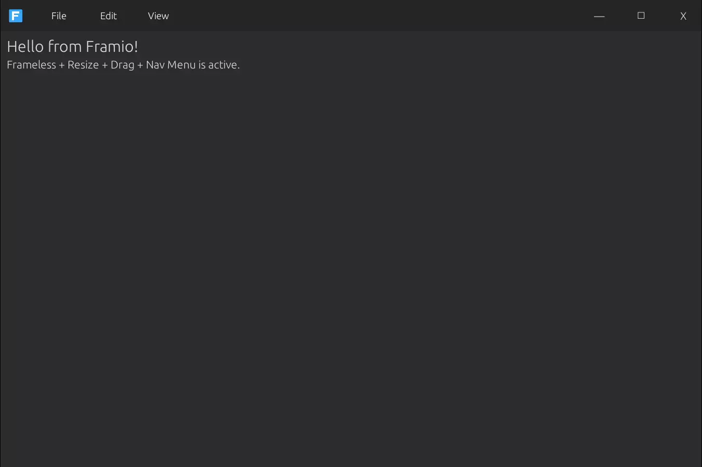

# Framio

[](https://www.rust-lang.org/)
[](LICENSE)


---

Framio is a frameless Windows shell built in Rust.  

It’s your starting point for modern apps without the clunky default title bars or outdated UI.  
Take full control of the window: top bar, menus, branding, resizing, and theming, all powered by [eframe/egui](https://github.com/emilk/egui).

---

## Dependencies

Framio is built on the latest stable versions.

```toml
[dependencies]
eframe = "0.32.1"
egui   = "0.32.1"
image  = "0.25.6"
```

## 📸 Preview



## 🚀 Getting Started

### Prerequisites

You need Rust (latest stable toolchain), Windows 10 or 11, and Cargo (bundled with Rust: check with `cargo --version`).

### Clone and Run

```bash
git clone https://github.com/SoloKingxRobert/Framio.git
cd Framio
cargo run
```

Or run the specific binary:

```bash
cargo run --bin framio
```


## 🧩 Project Structure

```
src
 ├─ Assets/
 │   └─ Logo/
 │       └─ Framio.png
 ├─ core/
 │   └─ window/
 │       ├─ layout/
 │       │   ├─ mod.rs
 │       │   └─ chrome.rs
 │       ├─ drag.rs
 │       ├─ menu.rs
 │       ├─ resize.rs
 │       └─ shell.rs
 ├─ ui/
 │   └─ theme/
 │       ├─ dark/
 │       │   └─ mod.rs
 │       ├─ colors.rs
 │       ├─ spacing.rs
 │       └─ typography.rs
 ├─ main.rs
target/
.gitignore
Cargo.lock
Cargo.toml
Framio.webp
README.md
```

---

## 🛠 Configuration

- **Frameless behaviour**: OS chrome disabled; you control title area, buttons, and hit-testing.
- **Top bar**: Reserved space for logo, menus, and actions (e.g. Support).
- **Window actions**: Click targets for minimise / maximise / close and a drag zone mapped to viewport commands.
- **Theme**: Palette constants defined once and applied across widgets for consistent brand visuals.

---

## 📝 License
Copyright © 2025 Robert Whaite  
Licensed under the [MIT Licence](LICENSE).

---

## 🔗 Links

- [Rust](https://www.rust-lang.org)
- [eframe/egui](https://github.com/emilk/egui)
- [Cargo](https://doc.rust-lang.org/cargo/)  
